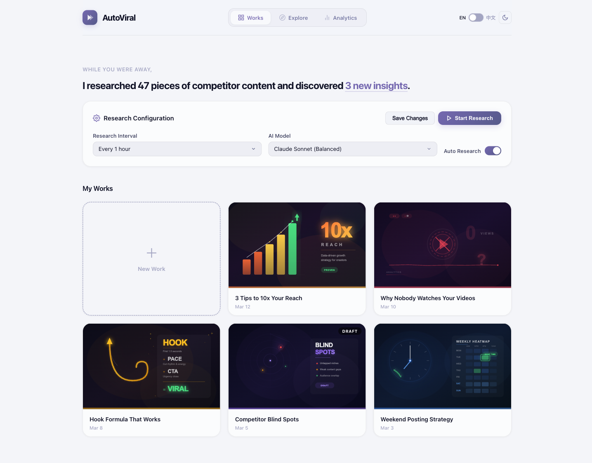

<h1 align="center">AutoViral</h1>

<p align="center">
  <strong>AI-powered social media research engine — discover trends, analyze competitors, create smarter content.</strong>
</p>

<p align="center">
  <a href="https://nodejs.org"></a>
  <a href="https://opensource.org/licenses/MIT"></a>
</p>

<p align="center">
  
</p>

---

**AutoViral** is a local-first AI research assistant for content creators. It runs in the background, continuously analyzing trending content across YouTube and TikTok, studying your competitors, and surfacing actionable insights — so you always know what to post next.

## The Problem

Content creators spend hours every week on research — scrolling through trending feeds, tracking competitors, analyzing what works. By the time you've gathered enough data, the trend has moved on. And the insights you found last week? Forgotten.

## How AutoViral Works

AutoViral runs a background AI research engine that does the heavy lifting:

```
┌─────────────────────────────────────────────────────────┐
│                      AutoViral                          │
│                                                         │
│   ┌──────────────┐  ┌──────────────┐  ┌─────────────┐  │
│   │   Trend       │  │  Competitor  │  │  Content    │  │
│   │   Research    │  │  Analysis    │  │  Insights   │  │
│   │              │  │              │  │             │  │
│   │ What's hot   │  │ What others  │  │ What should │  │
│   │ right now?   │  │ are doing?   │  │ YOU create? │  │
│   └──────┬───────┘  └──────┬───────┘  └──────┬──────┘  │
│          │                 │                 │          │
│          ▼                 ▼                 ▼          │
│   ┌──────────────────────────────────────────────────┐  │
│   │              Personalized Feed                   │  │
│   │  Trends + Competitor gaps + Your style profile   │  │
│   │         = Content ideas that actually work       │  │
│   └──────────────────────────────────────────────────┘  │
└─────────────────────────────────────────────────────────┘
```

### Works — Your Content Hub

Manage all your content projects in one place. Each "work" is a content piece — from initial idea through research to final draft. AutoViral tracks what you've created so it can recommend what to create next.

### Explore — Real-time Trend Discovery

Live trending data from YouTube and TikTok:

- **Trending Videos** — top-performing content with view counts, likes, and engagement metrics
- **Hot Topics** — hashtags and topics gaining momentum right now
- **Cross-platform comparison** — see what works on YouTube vs TikTok side by side

### Analytics — Know Your Audience

Your personal creator dashboard:

- **Style Profile** — AI-detected content style tags based on your work
- **Fan Demographics** — age, gender, and regional breakdown of your audience
- **Research Overview** — total content analyzed, insights generated, and activity stats
- **Latest Insights** — actionable recommendations like "Shorts under 30s outperform longer ones by 2.3x" or "Hook within first 1.5s critical for TikTok retention"

## Getting Started

### Prerequisites

- Node.js >= 18
- [Claude Code CLI](https://docs.anthropic.com/en/docs/claude-code) installed and authenticated

### Install & Run

```bash
# Clone the repo
git clone https://github.com/nanxingw/AutoViral.git
cd AutoViral

# Install dependencies
npm install

# Build and start
npm run build
autoviral start
```

The dashboard opens at **http://localhost:3271**.

### Configuration

Stored in `~/.skill-evolver/config.yaml`:

| Option | Default | Description |
|--------|---------|-------------|
| `interval` | `1h` | Time between research cycles |
| `model` | `sonnet` | AI model for research agents |
| `autoRun` | `true` | Auto-run research on interval |
| `port` | `3271` | Dashboard port |

## Features

| Feature | Description |
|---------|-------------|
| **Background Research** | AI continuously monitors trends while you focus on creating |
| **Multi-platform** | YouTube and TikTok trending data in one view |
| **Competitor Analysis** | Track what's working for others in your niche |
| **Style Profiling** | AI learns your content style and tailors recommendations |
| **Audience Insights** | Demographics and engagement patterns for your content |
| **Bilingual UI** | Full English and Chinese (中文) interface |
| **Dark Mode** | Easy on the eyes with elegant Glass Noir theme |
| **Mobile Responsive** | Full functionality on any device |

## Tech Stack

- **Backend** — Node.js, Hono, TypeScript
- **Frontend** — Svelte 5, Vite
- **AI Engine** — Claude (via Claude Code CLI)
- **Real-time** — WebSocket for live updates
- **Design** — Glass Noir theme, responsive layout

## Roadmap

- [ ] **Platform expansion** — Instagram Reels, X/Twitter, Reddit
- [ ] **Content calendar** — AI-suggested posting schedule based on audience activity
- [ ] **Auto-drafting** — Generate scripts and captions from research insights
- [ ] **Analytics API** — Connect real YouTube/TikTok analytics for personalized recommendations
- [ ] **Team collaboration** — Share research and insights across creator teams
- [ ] **Trend alerts** — Push notifications when relevant trends emerge

## License

MIT
